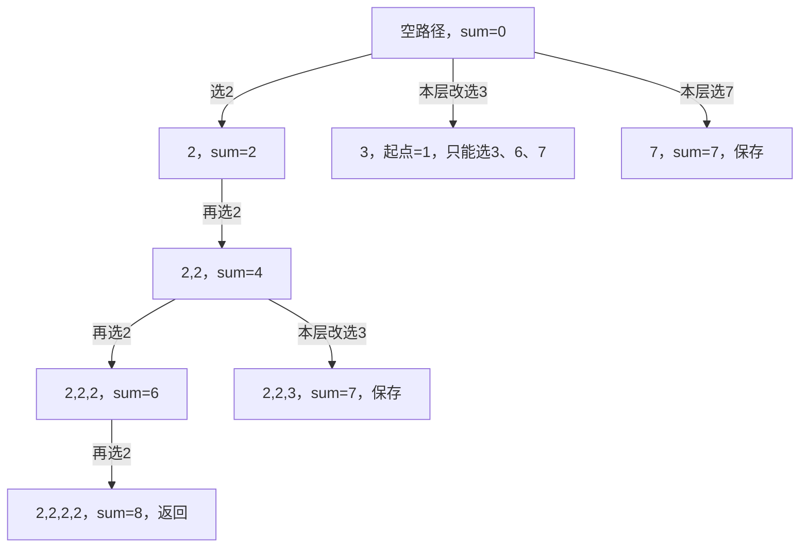

# 39. 组合总和

- 练习日期：2026-09-29。
- 状态：用户确认 LeetCode 通过，C++17 本地 1520 个输入复核通过；startIndex、同层循环与下一层递归的分工仍待巩固。
- 题目：候选值互不相同且均为正整数；每个候选可重复使用；返回和为 target 的不同组合，组合不区分选择顺序。
- 用户在 LeetCode 网页写题，本轮不建立仓库问题脚手架。

## 初版实现与编译疑问

用户每层从 candidates 下标 0 开始搜索，sum 超过 target 时返回，达到 target 时用集合尝试去重。

```cpp
class Solution {
public:
    vector<int> path;
    vector<vector<int>> res;
    unordered_set<vector<int>> uset;

    void backtracking(const vector<int>& candidates, int sum, int target) {
        if (sum > target) return;

        if (sum == target) {
            if (uset.count(path) == 0) {
                res.push_back(path);
                vector<int> temp(path);
                sort(temp.begin(), temp.end());
                uset.insert(temp);
            }
            return;
        }

        for (int i = 0; i < (int)candidates.size(); ++i) {
            int num = candidates[i];
            path.push_back(num);
            backtracking(candidates, sum + num, target);
            path.pop_back();
        }
    }

    vector<vector<int>> combinationSum(vector<int>& candidates, int target) {
        res.clear();
        path.clear();
        int sum = 0;
        backtracking(candidates, sum, target);
        return res;
    }
};
```

报错入口是测试器的 `Solution()`，提示 `Solution` 默认构造函数被隐式删除，因为成员 uset 的默认构造函数不可用。

## 编译失败的真正原因

`unordered_set<Key>` 的第二个模板参数默认是 `std::hash<Key>`。C++17 标准库没有提供可用的 `std::hash<vector<int>>`，所以不能直接声明构造 `unordered_set<vector<int>>`。

不是漏写 `Solution()`：自行增加空构造函数仍不能让该成员正常构造。也不是所有容器都不能保存 vector；例如 `set<vector<int>>` 利用 vector 的字典序比较，可以直接使用。无序集合也可以显式提供自定义哈希类型。

哈希值用于定位，相同 key 必须得到相同哈希值，哈希冲突允许发生。vector 的相等比较存在，不等于其默认哈希函数存在。详细语法与可编译示例见 [C++ unordered_set 章节](../01-cpp语法知识文档.md)。

参考标准草案：[unordered_set](https://eel.is/c++draft/unord.set)、[hash](https://eel.is/c++draft/unord.hash)、[vector 声明](https://eel.is/c++draft/vector.syn)。

## 能编译后仍有两个去重问题

### 查询与插入的 key 不一致

查询使用原始 path，插入却使用排序后的 temp。集合中的 vector 按元素顺序比较，`[2,2,3]` 与 `[2,3,2]` 是不同 key，不会自动视为同一组合。

例如先插入 `[2,2,3]`，随后 `uset.count([2,3,2])` 返回 0，又把 `[2,3,2]` 加入结果。之后排序并尝试插入 `[2,2,3]`，虽然集合没有新增，但结果中的重复组合已经产生。

保留集合方案时，应先排序副本，再用同一副本查询和插入；或用 `insert(temp).second` 决定是否保存：

```cpp
vector<int> temp = path;
sort(temp.begin(), temp.end());
if (uset.insert(temp).second) {
    res.push_back(temp);
}
```

以上片段需要先把集合声明修成可用的 `set<vector<int>>` 或提供自定义哈希，不是直接修复原声明。

### 独立调用前没有清空成员集合

入口清空了 path/res，但没有清空 uset。同一 Solution 对象执行新的独立求解时，旧结果会残留；若保留集合方案，应在入口同时 `uset.clear()`，不能在递归过程中清空。

## 后续优化方向：搜索时避免不同顺序

每层都从 0 开始，会搜索 `[2,2,3]`、`[2,3,2]`、`[3,2,2]`，这是排列式的枚举，但本题只需要组合。即使事后集合去重正确，这些重复搜索仍已发生。

加入 `startIndex`，候选循环只从 startIndex 开始；选择 candidates[i] 后，递归仍传 **i**。这样候选原始下标不下降，每种组合只沿一种下标顺序生成，同时允许再次选择当前数。候选互异时，这种索引约束不要求先排序数组。

- 78 子集：一个元素只能用一次，递归传 i+1。
- 39 组合总和：同一个元素可以重复使用，递归传 i。
- 46 全排列：顺序不同算不同答案，每层从头选择，使用 used 避免同一元素重复使用。
- 17 电话号码：每个数字位置必须参与，一层固定一个数字位置，只循环该组字母，不是组合总和的候选起点逻辑。

当前正整数前提下 sum 会随选择增大，`sum > target` 剪枝成立。若额外排序候选，可以在候选过大时提前结束本层循环，但这不是解决编译错误的必要条件。

## 本轮诊断验证

仅在系统临时目录中编译运行，没有改用户解法，也没有创建仓库测试脚手架。

1. 最小声明 `unordered_set<vector<int>>`：g++ C++17 编译失败，报告哈希函数不能以 key 类型调用及默认构造函数删除，确认与用户错误同源。
2. 静态断言确认 `hash<vector<int>>` 不可默认构造；普通整数集合与自定义 vector 哈希集合可默认构造。
3. `set<vector<int>>` 和自定义哈希集合都区分 `[2,2,3]` 与 `[2,3,2]`，排序后查询才命中。
4. 仅将原代码容器替换为 set，其他逻辑不变：`[2,3,6,7]`、target=7 返回 `[2,2,3]`、`[2,3,2]`、`[3,2,2]`、`[7]`，共 4 个结果，实际只有 2 种组合。
5. 同对象连续求解 `[2]`、target=2：第一次返回 `[[2]]`，第二次返回空，确认成员集合残留。

以上为初版阶段的错误诊断复现，不代表初版正确；后续通过状态和最终实现见本文末尾。

## 后续修改：加入 startIndex 后为什么答案为空

用户删除集合，改为通过起点限制选择，但递归调用的参数顺序与函数声明不一致：

```cpp
void backtracking(const vector<int>& candidates,
                  int sum, int startIndex, int target) {
    if (sum > target || startIndex >= (int)candidates.size()) return;

    if (sum == target) {
        res.push_back(path);
        return;
    }

    for (int i = startIndex; i < (int)candidates.size(); ++i) {
        int num = candidates[i];
        path.push_back(num);
        // 错误：第二个参数传给 sum，第三个参数传给 startIndex
        backtracking(candidates, startIndex, sum + num, target);
        path.pop_back();
    }
}
```

### 问题一：sum 与 startIndex 的位置传反

C++ 按位置对应实参与形参，不会根据调用处变量的名字推断其角色。声明要求第二个参数是 sum，第三个参数是 startIndex；错误调用却使下一层 sum 变成旧 startIndex，下一层 startIndex 变成旧 sum+num。两个参数都是 int，因此这次可以编译，但含义错误。

用 candidates=[2]、target=2 模拟：

1. 初始调用 sum=0、startIndex=0，候选个数为 1。
2. 选择 2 后 path=[2]，实际调用 `backtracking(candidates, 0, 2, 2)`。
3. 下一层得到 sum=0、startIndex=2；虽然 path 的真实和为 2，sum 参数却仍为 0。
4. startIndex=2 >= candidates.size()=1，直接 return，没有保存结果，最终得到空数组。

这不是入口调用的问题：入口 `backtracking(candidates, sum, startIndex, target)` 的顺序正确；错的是循环内部的递归调用。

### 问题二：下一层起点应是本次选择的 i

只把两项调回去、传 `sum+num, startIndex` 仍不够。循环 i 会尝试从 startIndex 到末尾的多个候选；选择了 i，就应使后续只选择下标不小于 i 的候选，否则仍可能回头产生同一组合的不同排列。

例如 candidates=[2,3]、target=5，若仅修顺序但仍传旧 startIndex=0，会同时产生 [2,3] 和 [3,2]。

本题所需递归调用是：

```cpp
backtracking(candidates, sum + num, i, target);
```

- `sum + num`：当前选择后的新总和，与更新后的 path 对应。
- `i`：当前选择的候选下标；下层从此位置开始，允许重复使用它，但不回头选择更小下标。
- `target`：目标值不变。

口诀：总和加当前数，起点用当前 i；可重复传 i，不可重复传 i+1。候选原数组不需要按值排序，下标不下降足以避免组合重复。

当前写法的 startIndex 越界终止不是该空结果的根本错误：修正为递归传 i 后，每个合法调用起点都来自有效候选下标。也可以省去该条件，让无候选的 for 循环自然结束，但仅删除它不能修复参数含义。

### 后续诊断验证

本轮临时目录 C++17 编译无警告，逐句保留用户逻辑并分别替换递归调用作对照：

- 原调用对 [2]、target=2 和 [2,3,6,7]、target=7 均返回空，复现报告。
- 只修参数顺序、仍传旧 startIndex：对 [2,3]、target=5 返回 [[2,3],[3,2]]，确认重复问题。
- 修正为 `sum+num, i, target` 后，6 个固定诊断通过，含 3 个题面示例、单候选可命中、去重及未排序候选；同一诊断对象复用入口 res/path 清空也正确。

以上为中间修改阶段的局部验证，当时尚未收到用户 LeetCode 通过反馈；后续用户已确认最终修正版通过，详见下文。

## 最终通过的用户实现

```cpp
class Solution {
public:
    vector<int> path;
    vector<vector<int>> res;

    void backtracking(const vector<int>& candidates, int sum, int startIndex, int target) {
        if (sum > target) return;

        if (sum == target) {
            res.push_back(path);
            return;
        }

        for (int i = startIndex; i < (int)candidates.size(); ++i) {
            int num = candidates[i];
            path.push_back(num);
            backtracking(candidates, sum + num, i, target);
            path.pop_back();
        }
    }

    vector<vector<int>> combinationSum(vector<int>& candidates, int target) {
        res.clear();
        path.clear();
        int sum = 0;
        int startIndex = 0;
        backtracking(candidates, sum, startIndex, target);
        return res;
    }
};
```

该版逻辑正确，不要求排序，不需要 used 或事后集合去重。参数位置已与声明一致，递归传 i 允许重复使用当前候选，同时限制后续下标不下降。

## 对照代码随想录：先定义一次调用的任务

指定 [代码随想录 39 页面](https://programmercarl.com/algo/backtracking/0039-combination-sum.html) 直连读取超时，按用户此前许可在侧边栏打开，成功读取回溯三部曲、基础 C++ 版、排序剪枝版及总结。无需用户本轮重新验证。以下解释与模拟为个人复盘，不复制文章全文。

一次 `backtracking(candidates, sum, startIndex, target)` 的任务是：path 已选好一些数字、总和为 sum，现在继续从下标 startIndex 到末尾补充候选，尝试凑到 target。

- path 是本次已有选择，不是全部答案。
- sum 是 path 当前总和，不是下标或递归层数。
- startIndex 是本层可以选择的最小下标，不是本层唯一可以选择的位置，也不是固定深度。
- for 的 i 是本层正在尝试的候选。递归开始下一层任务；递归返回后，本层撤销选择并继续自己的 i++。

### 横向循环换候选，纵向递归继续选

以 candidates=[2,3,6,7]、target=7 为例，只画关键分支，其余分支省略：



找到 [2,2,3] 的核心执行顺序：初始 sum=0/startIndex=0 → 选 2，下一层 sum=2/起点=0 → 再选 2，下一层 sum=4/起点=0 → 本层尝试 3，下一层 sum=7/起点=1 → 复制 path 到 res 并返回 → 添加这个 3 的父调用 pop_back，使 path 恢复 [2,2]，继续尝试本层后续候选。

其中 sum=4 这层先尝试 2 并探索其后代；这些后代全部返回、各层撤销完自己添加的数字后，才会在 sum=4 这一层改试 3。不是选完 2 后就同时执行所有同层分支。

return 只结束当前调用，不结束整棵搜索树；父调用继续在递归语句之后执行。每层只负责撤销自己添加的那个数字。

### 为什么传 i，为什么不重复

选择下标 i 后，下层从 i 开始，仍能再选这个数；不能选更小下标，因此不会走回头路。以当前输入为例，选 3 后起点为 1，就不能再选下标 0 的 2，所以 [3,2,2] 不会生成；[2,2,3] 仍可正常生成。

更一般地，候选值互不相同，每个组合的原始下标按非递减顺序排列只有一种形式，所以不会漏掉组合，也不会生成不同排列的重复答案。这是按下标限制，不要求按值排序；例如 candidates=[3,2] 时可以保存 [3,2]，同样正确。

本题不需要 used，正是因为同一个候选允许重复。与子集的 i+1 及排列的 used 要区分。

### 为什么没有固定深度终止条件

本题不要求选固定数量的元素，而要求总和等于 target。所有候选都为正数，所以继续选必定增加 sum：超过目标就返回，达到目标则保存并返回。这使无限次允许选择不等于无限递归。

sum<target 时也可能没有可用组合；该调用所有候选探索结束后自然返回。不需额外用 path.size 或 startIndex==n 来代表成功。

## 用户写法与文章基础版的区别

核心算法相同，主要是写法区别：

| 项目 | 用户实现 | 文章基础版 | 理解 |
|---|---|---|---|
| 参数顺序 | candidates, sum, startIndex, target | candidates, target, sum, startIndex | 顺序可以不同，但各自声明和调用必须一致 |
| 候选读取 | const vector<int>& | vector<int>& | 用户不修改输入，const 引用符合用途 |
| 总和更新 | 递归传 sum+num | 先修改本层 sum，再传 sum | 用户没有修改本层 sum，递归返回后无需减回去 |
| 状态撤销 | path.pop_back | sum 减回当前数、path.pop_back | 修改了什么就撤销什么，不应机械照抄撤销行 |
| 入口初始化 | res.clear/path.clear | result.clear/path.clear | 都能避免独立调用累积旧结果 |

用户的递归片段：

```cpp
path.push_back(num);
backtracking(candidates, sum + num, i, target);
path.pop_back();
```

本层 sum 若为 4、num 为 3，传递表达式得到下一层自己的 sum=7，本层仍为 4。整数 sum 按值传递，各层有自己的局部参数；成员 path 则被各层共同修改，递归不会自动还原它，因此仍需 pop_back。

文章先执行 sum+=num，是主动把本层 sum 从 4 改成 7，随后才调用下层；下层返回时，本层依旧是 7，所以文章要减回 3。用户写法不需添加该减法，否则会把本层总和错误减小。参见 [C++ 值传递与共享状态](../01-cpp语法知识文档.md)。

## 排序剪枝是优化，不是去重的必要前提

文章优化版先排序 candidates，再限制循环只尝试 sum+candidates[i]<=target 的候选。这样尚未添加数字时就知道分支不可能，不必像用户当前版那样先递归再判断超额。

使用用户参数顺序，可写为：

```cpp
// 入口先 sort(candidates.begin(), candidates.end());
for (int i = startIndex; i < (int)candidates.size(); ++i) {
    int num = candidates[i];
    if (sum + num > target) break;
    path.push_back(num);
    backtracking(candidates, sum + num, i, target);
    path.pop_back();
}
```

break 依赖升序：当前数已经太大，后面更大也不可能。未排序时只能跳过当前过大候选，例如 candidates=[7,2]、target=4；直接 break 会漏掉 [2,2]。这不是要求当前通过版必须排序；其 sum>target 返回只结束当前分支，未排序也正确。排序还会改变输入顺序，不必为理解基础方法立即替换用户代码。

## 复杂度的理解方式

设 n 为候选个数，T=target，a 为最小候选，D=floor(T/a)，R 为答案数，V 为实际访问的搜索节点数（包含超额剪枝节点）。

- 有效路径最多 D 个数字，当前先递归再剪枝的实现最多额外走一个超额节点；不计输出辅助空间 O(D+1)，包括递归栈和 path。
- 循环总计处理搜索树各条边，保存答案会复制 path，因此可描述时间为 O(V+R×D)。搜索可能随 T/a 增长很快，剪枝可以减少 V，不能按数组线性扫描看成 O(n)。
- 页面列出 O(n×2^n) 的简写，但本题允许重复选择，深度取决于目标与最小候选。个人复盘不机械沿用子集“每项选或不选”的 2^n 推导；以上用实际搜索规模和输出量说明。

## 最终复核与复习目标

临时目录内 g++ C++17 编译无警告，保留用户最终实现原逻辑，与独立“每种候选选 0/1/2/… 个”的参考枚举比较：

- 12 个固定输入：题面例子、单候选、目标 40、多次重复、无解、候选未排序等。
- 1008 个穷举输入：值 2..7 的 63 个非空子集 × 目标 1..16，部分候选反转以覆盖未排序情况。
- 500 个固定随机种子的输入：候选 2..40、最多 30 个互异值、目标 1..40，并保证参考答案数少于 150。
- 全部 1520 个通过，同时检查输入不变、复用同一对象、搜索结束 path 为空、真实路径和正确、原始候选下标非递减、无重复组合、已返回结果不受后续调用影响。

测试只在系统临时目录，不进入仓库，不建立问题脚手架。用户确认通过与本地复核通过不代表已熟练掌握；后续应脱离提示，先口述一次调用的任务，再重写递归与回溯。

复习口诀：组合不回头，重复留当前；够了存、超了停；循环换候选，递归继续选；改了什么，就撤销什么。
