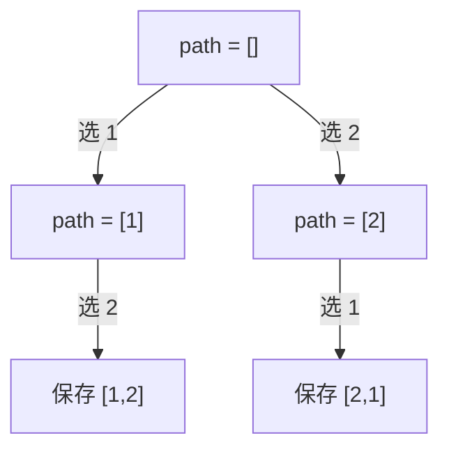
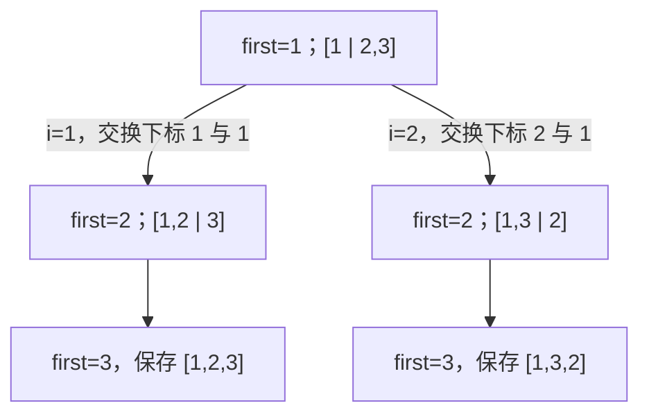

# 46. 全排列

状态：2026-09-29 用户已写出 path/res 成员变量 + used 数组的回溯实现，单次调用的算法正确；本地 C++17 校验 878 个输入通过，尚未收到用户确认 LeetCode 提交通过。已复现同一个对象再次调用时 res 残留，并建议在 permute 入口清空成员状态。本轮测试在系统临时目录执行，没有创建仓库内的本地问题脚手架。

## 用户当前实现

```cpp
class Solution {
public:
    vector<int> path;
    vector<vector<int>> res;

    void backtracking(const vector<int>& nums, vector<bool>& used) {
        if (path.size() == nums.size()) {
            res.push_back(path);
            return;
        }

        for (int i = 0; i < (int)nums.size(); ++i) {
            if (used[i] == false) {
                path.push_back(nums[i]);
                used[i] = true;
                backtracking(nums, used);
                used[i] = false;
                path.pop_back();
            }
        }
    }

    vector<vector<int>> permute(vector<int>& nums) {
        int n = (int)nums.size();
        vector<bool> used(n, false);
        backtracking(nums, used);
        return res;
    }
};
```

## 本轮审阅

- path 长度达到 nums 长度时收集完整答案并返回，正确。
- 每层从下标 0 开始选，used 防止同一排列重复使用同一个元素，正确。
- 添加 path 元素和设置 used 的选择操作，均在递归后撤销，正确；先解除 used 再 pop_back 也可以，这两步之间没有其他依赖状态的操作。
- res.push_back(path) 保存的是 vector<int> 的副本；后续 path.pop_back 不会更改已保存的排列。
- nums 为 const 引用，不修改输入，也不在每次递归复制整个数组，合适。

复习时说明不变量：进入一个递归调用时，path 是已选前缀，used 与此前缀对应；循环每次完成一个分支后，两者必须恢复到尝试该分支之前的状态。

## 同一个 Solution 对象重复调用

完整回溯结束后 path 已自然恢复为空，但 res 仍保存上次的所有答案，因为它是成员变量，不会在第二次调用时自动重新初始化。

本地复现：同一个对象先处理 [1,2,3]，得到 6 个排列；再处理 [0,1]，原版返回 8 个，而本次应只有 2 个。这是入口状态残留，不是递归选择逻辑错误。

建议只在公开入口 permute 的开头初始化：

```cpp
path.clear();
res.clear();
```

path.clear 是防御性初始化，res.clear 则避免答案累积。不要在每次 backtracking 调用里清空成员变量，否则会删掉父层路径与其他分支的答案。

## 本地校验记录

使用 g++ -std=c++17 -Wall -Wextra -pedantic 编译用户原版，没有编译警告。

单次调用测试使用新 Solution 对象：3 个题面示例、[-10,0,10]、6 个数字倒序输入，以及长度 1..6 的固定互异元素集合的每一种输入顺序，共 878 个输入。以排序后 std::next_permutation 独立枚举作为参考，忽略输出排列顺序比较全部结果，同时检查输入未被修改、搜索后 path 为空，全部通过。

另行确认复用对象时第二次调用为 8 个排列；清空成员状态再调用则恢复为正确的 2 个。这是本地校验结果，不代替用户的 LeetCode 提交反馈。

## 参考与个人理解

本题导读参考 [代码随想录：全排列](https://programmercarl.com/hot100/0046.permutations.html)，通用框架见 [回溯专题](../topics/14-回溯.md)。

本题要求所有顺序，而不是从中选择唯一最优方案。对没有重复数字的数组，把排列拆成逐个位置填数：第一个位置选一个数字，第二个位置选一个尚未使用的数字，一直选满 n 个位置。

## 与代码随想录逐项对照

用户指定的 [新版目录链接](https://programmercarl.com/algo/backtracking/0046-permutations.html) 首次直连读取超时，先对照了检索收录的同站 [原版全排列讲解](https://programmercarl.com/0046.%E5%85%A8%E6%8E%92%E5%88%97.html) 与上面的 Hot100 版本。同日用户在侧边栏自行完成验证后，已通过现有浏览器标签读取指定页面全文，并查看搜索树图；确认主要讲解与此前对照一致。以下为自己的学习整理，不复制整篇文章。

文章按三个步骤组织：确定递归参数及状态，确定完整排列的收集条件，确定本层候选与选择/递归/撤销。用户的实现已经对应这三个步骤，不需要换一种算法。

| 对照点 | 代码随想录写法 | 用户写法与结论 |
|---|---|---|
| 跳过已选元素 | if (used[i]) continue | if (!used[i]) 包住选择代码，作用相同 |
| 选择操作 | 先标记 used，再添加 path | 先添加 path，再标记 used；均在递归前完成即可 |
| 撤销操作 | 先 pop_back，再解除 used | 先解除 used，再 pop_back；均在下一候选前完成即可 |
| nums 参数 | vector<int>& | const vector<int>&，本题不修改 nums，更明确 |
| 入口初始化 | result.clear、path.clear | 用户入口未清空；复用同一对象时需要避免上次答案残留 |

一个调用可以理解为“决定排列的下一个位置”。本层 for 依次尝试这个位置的候选，递归则在已选前缀后继续填下一位置。

指定页面的搜索树图将 for 标为横向遍历、递归标为纵向遍历。对 nums=[1,2,3]，根处 path=[]；第一层的 [1]、[2]、[3] 是同一个 for 的三个候选分支，不是依次全部加入同一个 path。选了 1 后，递归进入下一层，当前 used 阻止再选 1，而允许选 2 或 3。末层有六个完整排列，达到 n 个元素时复制到结果。每个调用有自己的局部 i；递归返回后继续当前调用，而共享 path/used 的恢复需要显式撤销。

每层从 0 开始，不代表允许重复使用：例如 path=[2] 时，还必须有机会选择下标更小的 1，才能得到 [2,1,3]；used 才负责阻止在同一个排列中再次选择 2。它不是整次搜索永久的 visited。

记忆顺序：确定下一位置 → 遍历所有候选 → 跳过当前路径已使用者 → 做选择 → 探索后续 → 撤销本次选择。每个分支结束后，path 与 used 必须恢复到选择前。

复杂度口径提醒：原版页面写 O(n!)；若计入 n! 份答案各复制 n 个元素，更完整的时间为 O(n × n!)，同站 Hot100 版采用这个口径。不计结果存储时辅助空间为 O(n)。

## 三种状态

- path 保存当前尚未完成的排列。
- used[i] 表示 nums[i] 是否已经放进当前 path。
- result 保存完整排列的副本。

不需要将树实际创建为 TreeNode；它只是帮助理解候选分支和递归深度的模型。

## 对应代码动作

在某个位置考虑 nums[i] 时，如果 used[i] 为 true 就跳过。否则，将 nums[i] 加入 path，并置 used[i]=true；递归补齐后面的所有位置。递归返回后，删除 path 的末尾元素并置 used[i]=false，以恢复尝试 nums[i] 之前的状态。

一次调用的任务是“探索当前 path 的全部补齐方式”，而不是只在数组上顺序取一个数字。每次调用中的 for 从下标 0 开始；它们是不同调用自己的循环。

当 path.size()==nums.size() 时，复制保存 path，然后返回当前调用。该 return 不会自动清空共享 path。

## 先模拟前两个排列

```text
[] → [1] → [1,2] → [1,2,3]   保存第一个排列
                  [1,2]     父调用撤销 3
          [1]               上一层撤销 2
          [1,3] → [1,3,2]   保存第二个排列
```

数字 2 可以在第二条分支中重新使用，是因为选择 2 的上一层已经撤销 used 标记。每层只撤销自己添加的数字，不能直接清空整个 path。

## 再用两个数字解释返回位置

用户再次请求解释，先用 nums=[1,2] 减少分支，重点观察从第一个排列走到第二个排列的执行过程。



把入口 path=[] 的调用称为 A，进入时 path=[1] 的调用称为 B。这只是对调用编号，不代表每次递归都复制了一个 path。

1. A 的 i=0 选择数字 1，path=[1]、used=[true,false]，然后调用 B。
2. B 有自己的 for 和 i，从 0 开始。nums[0] 已使用，跳过；i=1 时选择 2，path=[1,2]、used=[true,true]，再调用下一层。
3. 下一层满足终止条件，复制保存 [1,2] 后 return；返回时 path 仍是 [1,2]，used 仍为 [true,true]。
4. 回到 B 的递归调用之后，执行 used[1]=false、path.pop_back，撤销 B 选的 2，恢复为 path=[1]。B 的 i 接着增加至 2，循环结束，函数自然返回 A。
5. A 从自己的递归调用之后继续执行，撤销 A 选的 1，恢复 path=[]、used=[false,false]。A 的 i 从 0 增加至 1，改选 2；后续递归就能选 1，保存 [2,1]。

重要区别：每次调用的局部 i 独立，内层 i 的变化不影响外层 i；成员 path/res 和引用参数 used 是共享状态，return 不会自动撤销它们的修改。used 下标对应 nums 下标，不是数字的数值。

扩展回 nums=[1,2,3]：保存 [1,2,3] 后先撤销 3，回到 [1,2]；这一调用结束后，上一层撤销 2，回到 [1]。入口前缀为 [1] 的调用仍可继续选择 3，找到 [1,3,2]，然后才结束该调用。外层必须等所有以 1 开头的排列处理完，才能撤销 1，改选 2。

记忆：选一个候选 → 递归找完此前缀下的全部补齐方式 → 返回后撤销本次选择 → 本层继续尝试下一候选。一次 leaf return 只退出当前调用，不会直接让整棵搜索结束。

## 官方交换式回溯

用户提供 [力扣官方全排列题解](https://leetcode.cn/problems/permutations/solutions/218275/quan-pai-lie-by-leetcode-solution-2/) 的交换式实现。本节分析用户贴出的完整代码，未另行读取该网页。

核心不变量：output[0..first-1] 是当前已选定的前缀，output[first..len-1] 是可用候选区，first 是本层要决定的位置。这里的“选定”只在探索当前分支时成立，回溯后会改选其他候选。

数组始终包含 len 个元素，“填位置”是决定这一位置放哪个现有数字，不是向数组新增元素。

例如 output=[1 | 2,3]、first=1，前缀 1 已选定，下一位置可选 2 或 3。output 是 nums 的引用参数，不是新建的数组；交换会暂时修改 nums，所有分支正常结束后成对撤销使 nums 恢复初始顺序。

```cpp
for (int i = first; i < len; ++i) {
    swap(output[i], output[first]);          // 将当前候选放到本层要填的位置
    backtrack(res, output, first + 1, len);  // 保持前缀，探索剩余位置
    swap(output[i], output[first]);          // 恢复本次交换前的数组
}
```

下层探索结束时，会先撤销下层自己的交换；因此返回本层后，output 已恢复到本层第一次 swap 刚执行完的状态。再交换相同两个位置，即可撤销本层选择。first+1 传给下层，本层的 first 没有被修改，不必手动减回来。i==first 的自身交换是允许的，代表选择当前位置已有的数字。

### 固定 1 后的两个分支



对于 i=2 的分支，第一次交换将 [1,2,3] 改成 [1,3,2]，递归找到 [1,3,2] 后返回；第二次交换下标 2、1，恢复 [1,2,3]。本层循环结束后，上一层才能继续考虑第一个位置的其他数字。

first==len 时，整个数组都属于已选前缀，复制保存完整 output。这里 res.emplace_back(output) 对 lvalue vector 执行拷贝构造，与本题中的 res.push_back(output) 一样保存独立的排列；后续交换不会修改已保存结果。

### 与 path + used 的对应

| path + used 版本 | 交换式版本 |
|---|---|
| path 保存已选前缀 | output 的前 first 个位置保存前缀 |
| path.size() 是下一位置 | first 是下一位置 |
| used 判断哪些候选可用 | 数组后缀直接存放未选候选 |
| 加入 path 并标记 used | 把候选交换到 first |
| 删除末尾并解除 used | 交换相同位置，撤销选择 |

为什么循环从 first 开始仍不漏排列：数组位置会随交换变化。例如第一个位置选 2 后，数组为 [2 | 1,3]，数字 1 虽然原来在下标 0，现在仍位于候选区，下一层可以选择它。first 不等于组合题中限制原始下标只能递增的 startIndex。

对 [1,2,3] 的 JavaScript 逐句模型得到 [1,2,3]、[1,3,2]、[2,1,3]、[2,3,1]、[3,2,1]、[3,1,2]；每个候选分支结束时检查数组等于本次调用入口的状态，均一致，完整搜索后输入恢复为 [1,2,3]。这是小样本算法模拟，不是本轮 C++ 编译，也不代替用户力扣提交反馈。

时间 O(n × n!)，保存每份答案需要复制 n 个元素；不计结果辅助空间 O(n)，主要来自递归调用栈。省去 path/used 不代表整体辅助空间 O(1)。

记忆：前缀已选，后缀候选；交换确定当前位置，递归处理下一位置，再交换恢复。

## 本轮练习

先独立说明 path、used、result 的作用，再回答：path=[1] 时可选择哪些数字？从 [1,2,3] 返回后，谁删除 3？要得到 [1,3,2]，为什么还必须撤销 2 的使用标记？理解后再写完整 permute，不将仅阅读题解标记为掌握。

完整排列有 n! 个，每个方案保存 n 个元素，时间 O(n × n!)；path、used 与递归调用栈各占 O(n)，不计返回结果时额外空间 O(n)。计入返回结果则需要 O(n × n!) 的存储。
